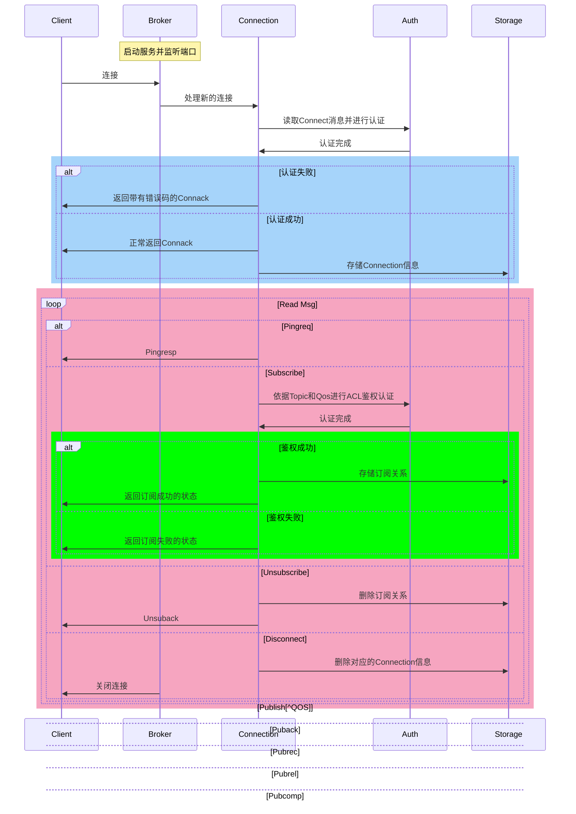

# Go实现Mqtt broker

MQTT broker的主要作用有两个，处理Publisher发布的消息，将消息投递给对应的Subscriber。

服务器的设计因此也分为几个模块：

- Server(broker)模块，接收客户端的连接并分发。
- Connection，客户端连接的抽象，维护了Connection的必要状态，包括最后一次活跃时间，消息发送队列等。
- Subscription Tree，一棵基数树，用来保存所有的订阅关系。
- Arrival Service，消息的重发模块，用来实现Qos1/2的服务质量。

下面的时序图展示了一个客户端和服务器的交互流程，以及服务器端对客户端发送的消息的处理


sequenceDiagram
    participant Client
    participant Broker
    participant Connection
    participant Auth
    participant Storage
    Note over Broker: 启动服务并监听端口
    Client->>Broker: 连接
    Broker->>Connection: 处理新的连接
    Connection->>Auth: 读取Connect消息并进行认证
    Auth->>Connection: 认证完成
    alt 认证失败
        Connection->>Client: 返回带有错误码的Connack
    else 认证成功
        Connection->>Client: 正常返回Connack
        Connection->>Storage: 存储Connection信息
    end
    loop Read Msg
        alt Pingreq
            Connection->>Client: Pingresp
        else Subscribe
            Connection->>Auth: 依据Topic和Qos进行ACL鉴权认证
            Auth->>Connection: 认证完成
            alt 鉴权成功
                Connection->>Storage: 存储订阅关系
                Connection->>Client: 返回订阅成功的状态
            else 鉴权失败
                Connection->>Client: 返回订阅失败的状态
            end
        else Unsubscribe
            Connection->>Storage: 删除订阅关系
            Connection->>Client: Unsuback
        else Disconnect
            Connection->>Storage: 删除对应的Connection信息
            Broker->>Client: 关闭连接
        else Puback
        else Pubrec
        else Pubrel
        else Pubcomp
        end
    end


[Publish服务质量]: https://leaxoy.github.io/2019/12/mqtt-protocol/#heading-11

7000
14500->16500
30000->35000

