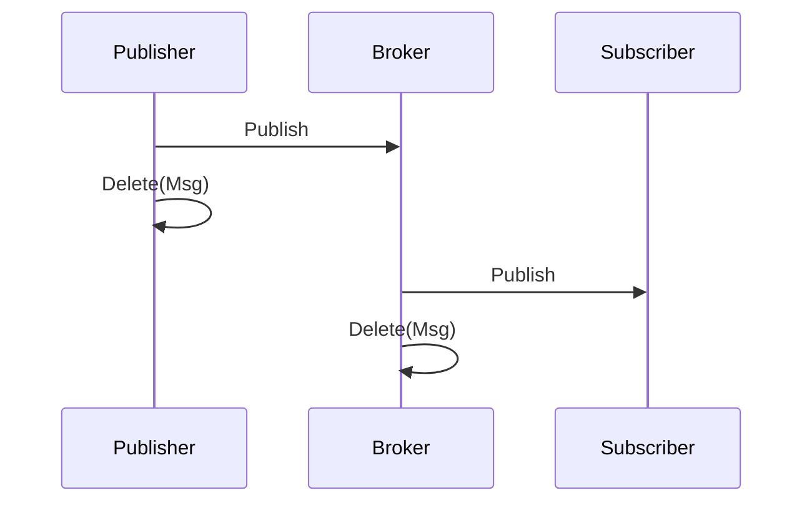
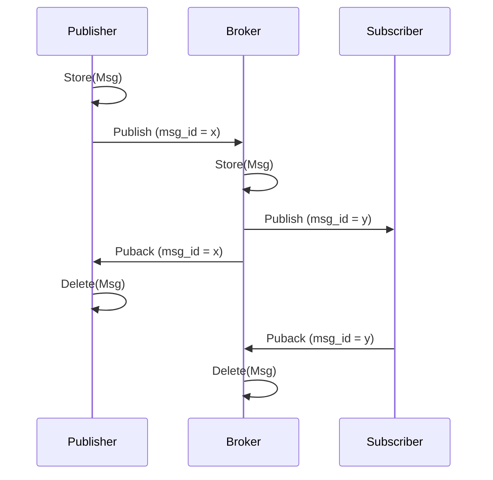
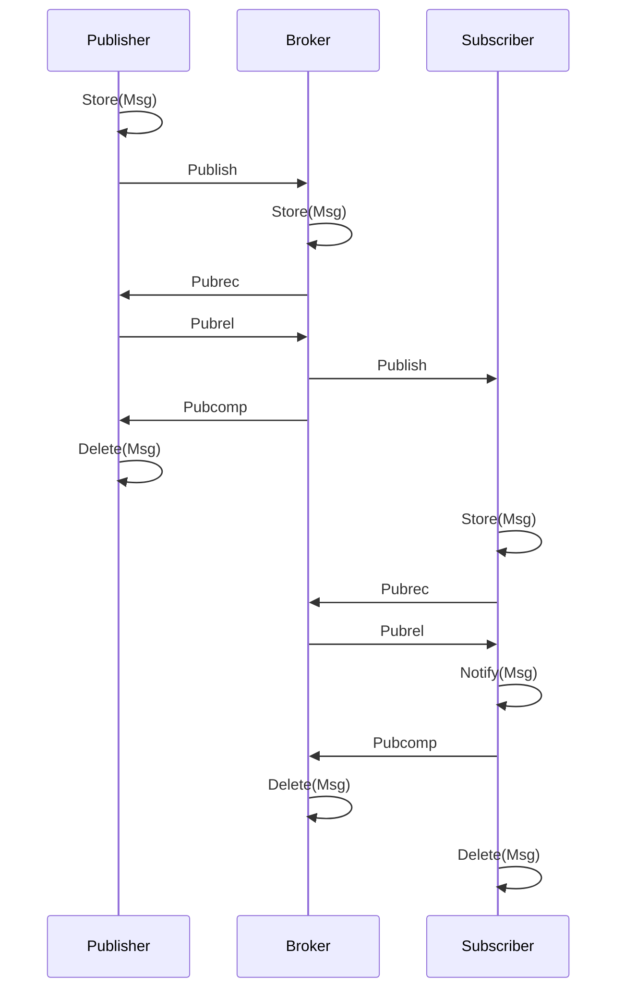

# Mqtt协议解析

> 这篇属于IM三剑客中的第二篇，前面一篇主要讲解了通用IM的一些架构的知识，这边主要讲解`MQTT`协议的细节，最后一篇将会着重介绍了MQTT Broker的Go语言实现。
> - [通用IM架构](https://leaxoy.github.io/2019/12/im-architecture/)
> - [Go实现Mqtt broker](https://leaxoy.github.io/2019/12/mqtt-implement-in-go/)

&emsp;&emsp;MQTT协议以其效率高，语义完善而著名，非常适合使用在移动设备中，可以大幅度的减少耗电量。相对于TCP，语义更加丰富，额外的overload小，最少只需要2byte；相对于其他的应用层协议Websocket等，头部简单，包体积更小。

## 相关术语
### Client(客户端)
客户端通常是用户手中的移动设备，传感器等，客户端在整个mqtt流程中既有publisher的作用，还有subscriber的作用，当作publisher的时候，客户端可以进行数据的上报，作为subscriber的时候，可以接收服务端推送的消息。
### Session
持久化的回话，一个session对应一个client，session会把还未来得及投递的消息进行持久化，以便下次client连接时进行推送。
### Broker
服务器端，client连接的对象，保存有所有的subscriber和publisher信息及其订阅关系，同时也用作消息的分发功能。
### Subscription
订阅关系，client可以依据topic进行订阅，可以接收发布到该topic的信息。
### Topic
Topic用作订阅关系的维系，类似于channel的概念。
### Topic Filter
主题过滤器，在MQTT中，topic可以是精确订阅，也可以是模糊订阅，发布到一个topic的消息，通过主题过滤器获取所有匹配的topic进行投递。
### Publisher
发布者，通常是客户端，向broker发布消息，borker收到消息后依据topic进行投递。
### Subscriber
订阅者，通常是客户端，订阅topic以接收broker分发的消息。

## 数据解包
&emsp;&emsp;`MQTT`数据包共分为三部分，`FixedHeader`, `Variable Header` 和 `Payload`, 其中只有`FixedHeader`是必须的，`Variable Header`和`Payload`部分是可选的。这部分着重介绍`FixedHeader`，可选部分将在下面的详细介绍中涉及。

&emsp;&emsp;固定头部的长度为`2...5 byte`，说到这里，可能有人迷糊了，既然说的是固定头部，怎么长度还有不同的选项呢。其实固定头部的意思并不是说长度固定，而是说每个数据包必须包含的意思，哪怕一个数据包什么内容都没有，也要有一个长度为2的头部数据。那么长度不固定的固定头部又该如何解释呢，因为不同的场景数据包的大小也不近相同，为了能让服务端知晓如何解析，解析到何处，就必须要把数据包的大小给编码到数据包中，数据包有大有小，如果用一个比较小的数字的话，就无法发送大于该数字的数据了，如果数据包比较小，但是编码用的数字又比较大的话，就会造成浪费的现象，所以针对不同大小的数据，需要用不同的方式对长度进行编码，这就是可变长度的由来。
>在`mqtt`中，数据包的大小由第2个byte到第5个byte来决定，最小为1个字节，最大为4个字节，加上头部固定的一个字节，正好是`2...5 byte`.

下面为`FixedHeader`的结构：

|        |  Bit 7  |  Bit 6  |  Bit 5  |  Bit 4  | Bit 3 | Bit 2 | Bit 1 |  Bit 0   |
| :----: | :-----: | :-----: | :-----: | :-----: | :---: | :---: | :---: | :------: |
| Byte 1 | MsgType | MsgType | MsgType | MsgType |  Dup  |  Qos  |  Qos  | Retained |
| Byte 2 | Has 3?  |         |         |         |       |       |       |          |
| Byte 3 | Has 4?  |         |         |         |       |       |       |          |
| Byte 4 | Has 5?  |         |         |         |       |       |       |          |
| Byte 5 |         |         |         |         |       |       |       |          |

### 第一个字节
&emsp;&emsp;第一个字节主要用做消息类型的控制，以及对应消息类型的额外的属性。按照bit分割，共有8bit，前四个bit用来表示数据包的类型，是connect还是publish，除了0和15外（用作保留类型），其他的14中均有不同的定义，下方分别给出了14中类型的详细的解释。[**详细解释**](#%e6%b6%88%e6%81%af%e7%b1%bb%e5%9e%8b)

#### 剩下的4bit
- 第一个bit，是`Duplicated`的意思，用在`publish`中`qos`为`1/2`的情况，用来表明该消息是否为一条重复的消息。
- 第2/3个bit，声明了`qos`的级别，可选的有`(0b00, 0b01, 0b10)`，分别代表了`(QOS0, QOS1, QOS2)`，不能有3，如果是3的话，会被认为成一个非法的数据包。
- 第四个bit，`Retained`，告知broker是否要将消息持久化，以供后来的订阅者消费。
### 剩下的字节
&emsp;&emsp;这个部分用来表示剩下的数据的长度，前面说了，这个部分长度是可变的，范围为`1-4`，那么如果来确定长度是1还是其他的呢，秘密就藏在字节的最高位(7bit)，这部分的所有数据，最高位bit都表明有没有后续的长度，如果这个值为0的话，表明没有后续的数据了，如果是一的话，表明还需要继续计算长度，因此能表明的数字最小为0，最大为`128 * 128 * 128 * 128 = 268435456 byte = 256 Mb`。
## 消息类型
### 连接与认证
#### Connect(`1`)
&emsp;&emsp;当客户端建立好与服务器的连接后，客户端发送的第一个报文必须是`Connect`，并且只能发送一次，服务端在收到第二个Connect的时候，会认为客户端异常而断开连接。·

#### Connack(`2`)
服务端响应，
### 心跳与保活
#### Pingreq(`12`)
客户端发送，无`Variable Header`与`Payload`，

#### Pingresp(`13`)

服务端响应，无`Variable Header`与`Payload`，

### 订阅
#### Subscribe(`8`)
#### Suback(`9`)
### 取消订阅
#### Unsubscribe(`10`)
#### Unsuback(`11`)
### 发布消息
#### Publish(`3`)
#### Pubrel(`6`)

用在`QOS2`消息的第二阶段，

### 接收消息
#### Puback(`4`)

&emsp;&emsp;用在`QOS1`的消息上，当收到`QOS1`的消息后，马上回复`Puback`的消息，同时设置`MessageId`为`Publish`消息的`MessageId`，

#### Pubrec(`5`)

&emsp;&emsp;用在`QOS2`消息的第一阶段

#### Pubcomp(`7`)

&emsp;&emsp;用在`QOS2`消息的第二阶段

### 断开连接
#### Disconnect(`14`)

&emsp;&emsp;当客户端主动断开连接时，主动发送`Disconnect`消息，该消息无`Varibale Header`与`Payload`。

------

## 服务质量保证
&emsp;&emsp;MQTT发布消息QoS保证不是端到端的，是客户端与服务器之间的。订阅者收到MQTT消息的QoS级别，最终取决于发布消息的QoS和主题订阅的QoS。

| 发布者发布的Qos | 订阅者订阅的Qos | 最终的QOS |
| :-------------: | :-------------: | :-------: |
|        0        |        0        |     0     |
|        0        |        1        |     0     |
|        0        |        2        |     0     |
|        1        |        0        |     0     |
|        1        |        1        |     1     |
|        1        |        2        |     1     |
|        2        |        0        |     0     |
|        2        |        1        |     1     |
|        2        |        2        |     2     |

> &emsp;&emsp;总而言之，言而总之，最终的QOS级别为两者中保证较弱的一方的QOS。即 `qos = min(qos Publisher, qos Subscriber)`

### Qos 0
&emsp;&emsp;Qos 0只会投递一次，没有任何到达的保证，数据从`Publisher`到`Broker`，再从`Broker`到`Subscriber`均为一次发送，**适合一些不那么重要的数据。**

### Qos 1

&emsp;&emsp;相对于Qos 0，Qos 1多了一次Ack的机制，publish->ack，发布完一条消息后，本地并不会马上删除，而是存储到一个inflight队列中并等待ack的到来，peer收到qos 1的消息后，马上进行ack操作，同时将消息提供给上游业务来处理，上游业务需要自行去重。后续的处理分为以下几种情况：
- 及时收到ack，删除本地inflight队列中数据即可。
- 未能收到ack，分为以下几种情况：
- - publish失败，只需重新发送即可。
- - ack丢失，重新发送，服务端进行ack，上游业务去重。

> 对于Qos1/2的消息，通常来说，pending状态的消息是有上限的，当达到上限时，可以丢弃掉消息，并且告知本地的上游业务。

### Qos 2

&emsp;&emsp;Qos2，恰好一次是最理想的状态，然后现实中因为各种各样的问题，是很难100%实现的，因此我们就需要各种协议来尽可能的保证恰好一次的语义，相对于Qos1，Qos2保证了恰好一次，Qos1只能保证至少一次，消息的去重需要上游业务处理，Qos2保证丢给上游业务的消息也是恰好一次的。

&emsp;&emsp;在Qos1中，客户端需要根据不同的情况进行多次重试，Subscriber一旦收到任何消息后就会把消息传递给上游，在Qos2中，我们希望Publisher可以知道Subscriber已经收到消息了，但是先不要投递给上游的业务（一旦投递给上游后，但Publisher并不知道Subscriber已经收到消息了，可能会造成多次的投递），因此当Subscriber收到消息后，回复一次我已经收到了（Pubrec），Publisher收到回复后，知道Subscriber已经收到消息，接下来告知Subscriber可以把消息提交给上游了（Pubrel），Subscriber收到Pubrel后，将消息提交到上游，并且告知Publisher完成投递（Pubcomp），Publisher收到消息后，知道投递完成，删除本地的消息。

&emsp;&emsp;这个过程有没有感觉和分布式事务中的2PC非常类似，第一阶段（Prepare），第二阶段（Commit）。

