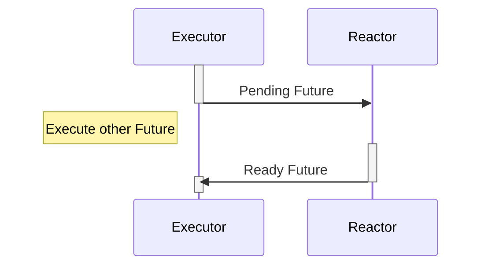
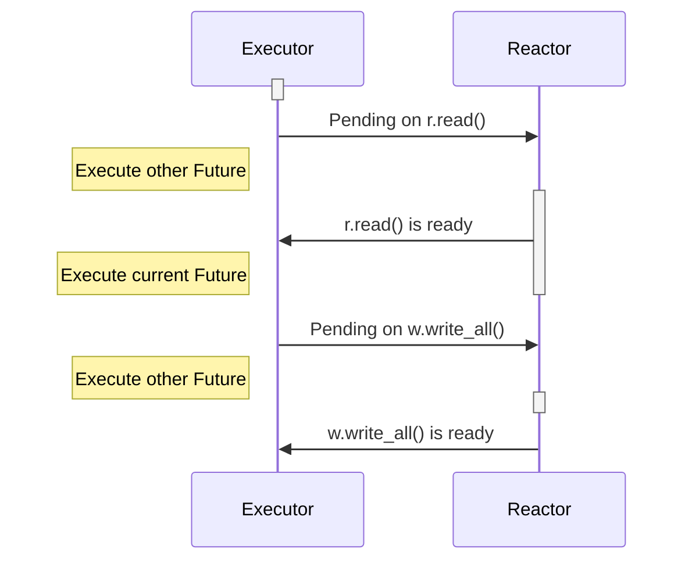

# Rust异步浅谈

## 前提
&emsp;&emsp;这篇文章主要描述了Rust中异步的原理与相关的实现，Rust异步也是在最近的版本(1.39)中才稳定下来。希望可以通过这边文章在提高自己认知的情况下，也可以给读者带来一些解惑。(**来自于本人被Rust异步毒打的一些经验之谈**).

&emsp;&emsp;阅读这篇文章需要对操作系统，IO多路复用，以及一些数据结构有一定的概念。

&emsp;&emsp;老生常谈，几乎所有的语言中异步相关的解释都是统一的：**线程切换开销大，且资源浪费（主要集中在内存上）**，这篇文章假定读者已对这些情况已知晓。
## Future
&emsp;&emsp;`Future` 字面的意思就是未来发生的事情，在程序中则代表了一系列暂时没有结果的运算子，`Future`需要程序主动去`poll`(轮询)才能获取到最终的结果，每一次轮询的结果可能是`Ready`或者`Pending`。

&emsp;&emsp;当`Ready`的时候，证明当前`Future`已完成，代码逻辑可以向下执行；当`Pending`的时候，代表当前`Future`并未执行完成，代码不能向下执行，看到这里就要问了，那什么时候才能向下执行呢，这里的关键在于`Runtime`中的`Executor`需要不停的去执行`Future`的`poll`操作，直至`Future`返回`Ready`可以向下执行为止。等等，熟悉`Linux`的同学可能要说了，怎么感觉和`Epoll`模型是非常的相似呢，没错，这确实非常相像(但是依然有些许不同，`Future`可以避免空的轮询)，看样子优秀的设计在哪里都可以看到类似的身影。为了实现Rust声称的高性能与零开销抽象，这里做了一些优化，下面一一讲述。

### Future结构

```rust
pub enum Poll<T> {
    Ready(T),
    Pending,
}

pub trait Future {
    type Output;

    fn poll(self: Pin<&mut Self>, cx: &mut Context<'_>) -> Poll<Self::Output>;
}
```

`Future`的定义非常简单，`Output`代表了`Future`返回的值的类型，而`poll`方法是执行`Future`的关键，`poll`方法可以返回一个`Poll`类型，`Poll`类型是一个`Enum`，包装了`Ready`和`Pending`两种状态。

## Context
`Context`提供了对`Future`进行调度的功能。目前`Context`作为一个结构体，有一个核心成员`Waker`，用来唤醒绑定的`Future`. 未来不排除在`Context`添加新的字段。
```rust
pub struct Context<'a> {
    waker: &'a Waker,
    // Ensure we future-proof against variance changes by forcing
    // the lifetime to be invariant (argument-position lifetimes
    // are contravariant while return-position lifetimes are
    // covariant).
    _marker: PhantomData<fn(&'a ()) -> &'a ()>,
}
```
```rust
pub struct Waker {
    waker: RawWaker,
}

impl Waker {
    /// 唤醒绑定在 Waker 上的数据，通常是 Future
    pub fn wake(self) {}
    pub fn wake_by_ref(&self) {}
    pub fn will_wake(&self, other: &Waker) -> bool {}

    pub unsafe fn from_raw(waker: RawWaker) -> Waker {}
}

pub struct RawWaker {
    /// A data pointer, which can be used to store arbitrary data as required
    /// by the executor. This could be e.g. a type-erased pointer to an `Arc`
    /// that is associated with the task.
    /// The value of this field gets passed to all functions that are part of
    /// the vtable as the first parameter.
    data: *const (),
    /// Virtual function pointer table that customizes the behavior of this waker.
    vtable: &'static RawWakerVTable,
}

/// RawWaker 行为的虚函数表
pub struct RawWakerVTable {
    clone: unsafe fn(*const ()) -> RawWaker,
    wake: unsafe fn(*const ()),
    wake_by_ref: unsafe fn(*const ()),
    drop: unsafe fn(*const ()),
}

```
## Runtime

`Runtime` 由两部分组成，`Executor`和`Reactor`。

`Executor`为执行器，没有任何阻塞的等待，循环执行一系列就绪的`Future`，当`Future`返回`pending`的时候，会将`Future`转移到`Reactor`上等待进一步的唤醒。

`Reactor`为反应器(唤醒器)，轮询并唤醒挂载的事件，并执行对应的`wake`方法，通常来说，`wake`会将`Future`的状态变更为就绪，同时将`Future`放到`Executor`的队列中等待执行。
### 执行流程
下面的序列图大概简单的描绘了`Future`在`Executor`和`Reactor`之间来回转移的流程与状态变化。



上面说明了一个简单的`Future`的执行，如果是一个比较复杂的`Future`的话，比如中间会有多次`IO`操作的话，那么流程是怎么样的呢？看下面一段代码：(仅仅作为demo，不代表可以直接使用)

```rust
async fn read_and_write(s: TcpStream) {
  let (mut r, mut w) = s.split();
  let mut buffer = r.read().await.unwrap();
  buffer.append("Hello,world");
  w.write_all(buffer.as_bytes()).await.unwrap();
}
```

对应的执行流程为：



> &emsp;&emsp;上面的这些例子系统中只展示了一个`Future`的执行情况，真实的生产环境中，可能有数十万的`Future`同时在执行，`Executor`和`Reactor`的调度模型要更复杂一些。
### 总结
一句话概括`Runtime`，`Future`不能马上返回值的时候，会被交给`Reactor`，`Future`的值准备就绪后，调用`wake`传递给`Executor`执行，反复执行，直至整个`Future`返回`Ready`。

## Executor
&emsp;&emsp;通常来说，`Executor`的实现可以是单线程与线程池两个版本，两种实现间各有优劣，单线程少了数据的竞争，但是吞吐量却容易达到瓶颈，线程池的实现可以提高吞吐量，但是却要处理数据的竞争冲突。下面我们以[`async-std`](https://github.com/async-rs/async-std)来分析基于线程池的实现：
```rust
/// The state of an executor.
struct Pool {
    /// 全局任务队列
    injector: Injector<Runnable>,

    /// 线程的本地队列，用来进行任务的偷取
    stealers: Vec<Stealer<Runnable>>,

    /// 存放空闲的线程，用来后续的唤醒并执行任务
    sleepers: Sleepers,
}

// 全局的线程池
static POOL: Lazy<Pool> = Lazy::new(|| {
    let num_threads = num_cpus::get().max(1);
    let mut stealers = Vec::new();

    // Spawn worker threads.
    for _ in 0..num_threads {
        let worker = Worker::new_fifo();
        stealers.push(worker.stealer());

        let proc = Processor {
            worker,
            slot: Cell::new(None),
            slot_runs: Cell::new(0),
        };

        thread::Builder::new()
            .name("async-std/executor".to_string())
            .spawn(|| {
                let _ = PROCESSOR.with(|p| p.set(proc));
                abort_on_panic(main_loop);
            })
            .expect("cannot start a thread driving tasks");
    }

    Pool {
        injector: Injector::new(),
        stealers,
        sleepers: Sleepers::new(),
    }
});

/// 工作线程的状态
struct Processor {
    /// 本地任务队列
    worker: Worker<Runnable>,

    /// 存放了比本地队列中任务优先级更高的任务，通常第一次spawn会放到这里，
    /// 执行一次poll来快速判断状态，对于无阻塞的任务更高效，不需要等待。
    slot: Cell<Option<Runnable>>,

    /// How many times in a row tasks have been taked from the slot rather than the queue.
    slot_runs: Cell<u32>,
}

fn main_loop() {
    loop {
        match find_runnable() {
            Some(task) => task.run();
            None => {
                // 实际上，这里根据空循环的次数，会陷入睡眠状态或出让CPU资源，直到新的task来唤醒。
            }
        }
    }
}

fn find_runnable() -> Option<Task> {
    // 优先从本地的队列中获取
    let task = get_local();
    if task.is_some() {
        return task;
    }
    // 其次从全局队列中获取
    let task = get_global();
    if task.is_some() {
        return task;
    }
    // 最后尝试从其他线程的本地队列中偷取
    steal_other()
}

/// 安排新的任务到Executor的执行队列中
pub(crate) fn schedule(task: Runnable) {
    PROCESSOR.with(|proc| {
        // If the current thread is a worker thread, store it into its task slot or push it into
        // its local task queue. Otherwise, push it into the global task queue.
        match proc.get() {
            // 如果当前线程为worker线程，插入到当前线程的第一优先级任务槽
            Some(proc) => {
                // Replace the task in the slot.
                if let Some(task) = proc.slot.replace(Some(task)) {
                    // 尝试把任务的优先级提升到最高，并把上一个优先级最高的任务放到当前线程任务队列
                    // If the slot already contained a task, push it into the local task queue.
                    proc.worker.push(task);
                    POOL.sleepers.notify_one();
                }
            }
            // 如果当前线程不是worker线程的话，放到全局队列
            None => {
                // 将任务放到全局队列中
                POOL.injector.push(task);
                // 尝试唤醒一个睡眠的worker线程
                POOL.sleepers.notify_one();
            }
        }
    })
}
```
这里做了大量的简化，整个Executor是一个线程池，每个线程都在不断的寻找可执行的task，然后执行，然后再找下一个task，再执行，永远重复。

> 从上面的main_loop中可以看到，cpu并不是一直毫无意义的空转，中间会有一些策略来优化cpu的使用。
## Reactor
&emsp;&emsp;`Reactor`作为反应器，上面同时挂载了成千上万个待唤醒的事件， 这里使用了[`mio`](https://github.com/&emsp;tokio-rs/mio)统一封装了操作系统的多路复用`API`。在`Linux`中使用的是[`Epoll`](https://zh.wikipedia.org/wiki/Epoll)，在`Mac`中使用的则是[`Kqueue`](https://zh.wikipedia.org/wiki/Kqueue)，具体的实现在此不多说。

&emsp;&emsp;在Future的基础上，出现了`AsyncRead/AsyncWrite/AsyncSeek`等抽象来描述IO操作，在执行对应的`Read/Write/Seek`操作时，如果底层的数据尚未准备好，会把所在的Future注册至Reactor。Reactor的流程如下:
```rust
loop {
    poll.poll(&events, timeout);
    for event in events.iter() {
        if (event.is_readable()) {
            for waker in event.readers.wakers {
                waker.wake();
            }
        }
        if (event.is_writeable()) {
            for waker in event.writers.wakers {
                waker.wake();
            }
        }
    }
}
```
`Reactor`会不断的`poll`就绪的事件，然后依次唤醒绑定在事件上的`waker`，`waker`唤醒的时候会把对应的`task`移动到`Executor`的就绪队列上安排执行。
> 结合`Executor`的运作原理不难发现，`Executor`肯定不会`poll`到未就绪的`task`，因为只有就绪的任务才会被`Reactor`放到`Executor`的执行队列中，`Executor`的资源利用率再一次被提高，这就是整个异步体系的高明之处。
## Stream
&emsp;&emsp;`Future`是异步开发中最基础的概念了，如果说`Future`代表了一次性的异步值，那么`Stream`则代表了一系列的异步值。`Future`是1，`Stream`是0，1或者N。 签名如下：
```rust
pub trait Stream {
    type Item;

    fn poll_next(self: Pin<&mut Self>, cx: &mut Context<'_>) -> Poll<Option<Self::Item>>;
}
```
`Stream`对应了同步原语中的`Iterator`的概念，回忆一下，是不是连签名都是如此的相像呢！
```rust
pub trait Iterator {
    type Item;

    fn next(&mut self) -> Option<Self::Item>;
}
```
`Stream`用来抽象源源不断的数据源，当然也可以断（当 `poll` 到 `None` 的时候）。可以用来抽象 `Websocket Connection` 读取端，在`Websokcet`中，服务端源源不断的接受客户端的值并处理，直至客户端断开连接。更进一步的抽象，`MQ`中的`Consumer`, `Tcp`中接收方，都可以看作是一个`Stream`, 因此`Stream`的抽象对异步编程意义非凡。
> 思考: 除了上面的几种情况，还有什么可以抽象成`Stream`模型呢？
## Sink
有了代表一次性的异步值`Future`, 也有了代表可重复的异步值的`Stream`, 因此，需要有一个代表一次或多次的异步值的通道，也就是接下来的`Sink`。通常来说, `Sink`可以来抽象网络连接的写入端，消息队列中的 `Producer`。
```rust
pub trait Sink<Item> {
    type Error;

    fn poll_ready(self: Pin<&mut Self>, cx: &mut Context<'_>) -> Poll<Result<(), Self::Error>>;
    fn start_send(self: Pin<&mut Self>, item: Item) -> Result<(), Self::Error>;
    fn poll_flush(self: Pin<&mut Self>, cx: &mut Context<'_>) -> Poll<Result<(), Self::Error>>;
    fn poll_close(self: Pin<&mut Self>, cx: &mut Context<'_>) -> Poll<Result<(), Self::Error>>;
}
```
在Sink的上层，我们可以封装 `send` 以及 `send_all` 等方法，用来抽象对应的 `Future` 与 `Stream`.
## Timer
&emsp;&emsp;很多情况下，我们希望可以延时执行一些操作，比如定时发送邮件，每隔一段时间生成一次报表。我们首先想到不就是`sleep`一段时间就行了，下面的代码：
```rust
pub fn get_next_day() -> Time {
    thread::sleep(Duration::hour * 24);
    current_time()
}

pub fn run_every_hour() {
    for thread::sleep(Duration::hour) {
        do_something();
    }
}
```
是不是很机智呢！😂😂😂！ 遗憾的是，我们写完这段代码，提交后，还没上线，估计就要滚蛋了。因此，我们想要的是一个不阻塞当前线程的定时器，定时器到期自动唤醒并执行之后的操作。

&emsp;&emsp;不同于`Tcp/Udp/Uds`，`mio`没有提供对`Timer`的封装。

&emsp;&emsp;通常来说，对定时器的处理要么是时间轮，要么堆，要么红黑树(时间复杂度更为平均`O(log n)`)。时间轮比较典型的案例就是在`Kafka`中的使用了，`Go Runtime` 用的则是堆，红黑树和堆的实现大致相同。

1. 时间轮算法可以想象做钟表，每一格存储了到期的定时器，因此时间轮的最小精度为每一格所代表的时间(因此时间轮算法不适合用于对精度要求高的场景)。如果定时器的时间超过时间轮所能表示的时间怎么办呢，也简单，可以通过两种方式来优化。
- 多级时间轮来优化，可以想象，在钟表上，秒针每走一圈，分针走一格，同理分针走一圈，时针走一格，因此多级时间轮中，第一级的时间最为精确，第二级次之，第三级再次之..., 超过某一级时间轮所能表示的事件后，将定时器放到下一级时间轮中。
- 超过时间轮所能表示的时间范围后，对时间取余，插入到余数所在的格子中，这样一来，每个格子中存放的定时器需要加入轮数的记录，用来表明还差多少轮才能执行。每个格子中在插入新的定时器时，可以使用堆来堆定时器进行排序。
2. 堆定时器(红黑树定时器)

&emsp;&emsp;使用最小堆来维护所有的定时器。一个工作线程不断的从堆里面寻找最近的定时器，如果定时器的时间比当前时间小，则唤醒该定时器对应的task，如果未达到设定的时间，则进行`Thread::park(deadline-now)`操作，让出当前cpu一段时间。
> 目前futures-timer的实现为全剧唯一的一个堆。存在可优化空间, 比如 `Go 1.14` 的实现，把定时器提交到当前worker thread的本地堆里面，用来避免锁竞争，提高性能。

## 组合子
上面定义了实现异步的最基本概念，`Future`, `Stream`以及`Sink`。

但是很多情况下，我们直接使用它们来构建我们的应用是非常困难的，例如：多个互为竞争关系的`Future`，我们只需其中任意一个`Future`返回即可，能想到的做法是，我们不断的遍历所有的`Future`，直到某一个返回`Ready`:
```rust
loop {
    for f in futures {
        if f.is_ready() {
            return f.output();
        }
    }
}
```
我们可以把上面的逻辑给包装一下，提供一个名为`select!(futures...)`的宏，`select`便可作为一个组合子而存在。类似的组合子还有很多，比如`join(futures...)`，等待所有`Future`完成。

更多的可以参考[`futures-util`](https://docs.rs/futures-util/0.3.4/futures_util/).
## Async/Await
上面所有的概念共同组成了`Rust`的异步生态，那么现在想象一下，如何获取一个`Future`运行的结果呢。一个可能的做法如下：
```rust
loop {
    match f::poll(cx) {
        Poll::Ready(x) => return x;
        Poll::Pending => {}
    }
}
```
如果每次都要用户这么做的话，将会是多么痛苦的一件事儿呀，还不如用注册回调函数来实现异步呢！

有没有更精炼的方式来获取`Future`的值呢，这就是`async/await`出现的原因了。本质上来说，`async/await`就是上面代码段的一个语法糖，是用户使用起来更加的自然。上面的代码可以替换成：
```rust
let x = f.await;
```
**是不是有非常大的简化呢！**

## 总结
虽然上面提到了各种各样的概念，但是仔细捋一下，便会发现整个异步可以分为三层：
1. `Future/Stream/Sink`，`Reactor/Executor`直接作用于前面的三种类型。此层是为底层，一般用户很少接触，库的开发者接触较多。
2. 组合子层，为了提供更为复杂的操作，诞生了一系列的异步组合子，使得异步变得更利于使用，用户会使用这些组合子来完成各种各样的逻辑。
3. `async/await`，准确的说，这层远没有上面两层来的重要，但是依然不可或缺，这层使得异步的开发变得轻而易举。

### 注意的地方
1. 不要在任何异步函数中执行任何阻塞操作，不仅仅是`thread::sleep`, 还有标准库的`Tcp/Udp`, 以及`sync`中的`channel`, `Mutex`, `RWLock` 都不应该继续使用，除非你知道你在干什么！替换为`async-std` 与 `futures`中实现的版本。
2. 如非必要，不要自己尝试去实现`Future`，自己实现的没有触发`wake`操作的话，将永远不会唤醒，取而代之，用已经实现好的`Future`进行组合。
3. 使用`async/await`代替所有需要异步等待的点，这将会极大的简化你的代码。

